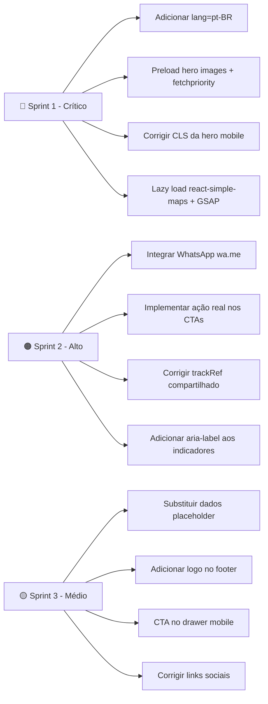

# Design Review – Dr. Rodrigo Silva Site

**Review Date**: 2026-03-09  
**URL**: https://drrodrigosilva.netlify.app/  
**Focus Areas**: Visual Design · UX/Usability · Responsive/Mobile · Accessibility · Micro-interactions/Motion · Consistency · Performance  
**Benchmark chosen by Kombai**: Premium single-doctor dental brands (Aesthetic dentistry positioning, luxury healthcare UX)

---

## Summary

O site tem uma identidade visual **forte e premium** — o binômio azul profundo + dourado transmite autoridade e sofisticação coerentes com a proposta do Dr. Rodrigo. Entretanto, a auditoria encontrou **23 problemas**: 4 críticos centrados em performance (LCP quase 5× acima do limiar) e gaps de acessibilidade estruturais, 9 de alta prioridade cobrindo responsividade e UX, e 10 médios/baixos envolvendo consistência de código e pequenos refinamentos visuais.

---

## Web Vitals Mensurados (Desktop – Netlify)

| Métrica | Valor Medido | Limiar Ideal | Status |
|---------|-------------|--------------|--------|
| FCP | 2.768 s | < 1.8 s | 🔴 Crítico |
| LCP | 11.920 s | < 2.5 s | 🔴 Crítico |
| CLS | 0.162 | < 0.10 | 🔴 Crítico |
| TBT | 4.425 s | < 0.20 s | 🔴 Crítico |
| INP | 416 ms | < 200 ms | 🟠 Alto |
| TTFB | 370 ms | < 800 ms | ✅ OK |
| Page Size | ~2.0 MB | < 1.0 MB | 🟠 Alto |

---

## Issues

| # | Issue | Criticidade | Categoria | Localização |
|---|-------|-------------|-----------|-------------|
| 1 | **LCP de 11.9 s** — A imagem de fundo da hero (`background-herosection.webp`) e a foto do Dr. Rodrigo são carregadas sem `fetchpriority="high"` e estão como `eager` mas sem preload no `<head>`. O LCP ideal é < 2.5 s. | 🔴 Crítico | Performance | `dr-rodrigo-site/index.html`, `src/components/ui/ResponsiveImage.tsx` |
| 2 | **TBT de 4.4 s** — O bundle combina Framer Motion, GSAP, react-simple-maps e um loop `requestAnimationFrame` no carrossel de serviços rodando continuamente mesmo fora do viewport. O resultado é bloqueio de thread principal severo. | 🔴 Crítico | Performance | `dr-rodrigo-site/src/components/sections/Services.tsx:352-369` |
| 3 | **CLS de 0.162** — Na hero mobile, a imagem do médico usa `transform: scale(1.6)` sem reservar espaço fixo antes do carregamento. Ao renderizar, o DOM inteiro sofre deslocamento. Limiar: 0.10. | 🔴 Crítico | Performance / Responsive | `src/components/sections/Hero.tsx:79-95` |
| 4 | **Sem `lang="pt-BR"` no `<html>`** — Leitores de tela (NVDA, JAWS, VoiceOver) não conseguem selecionar automaticamente o motor de síntese correto em Português. | 🔴 Crítico | Acessibilidade | `dr-rodrigo-site/index.html:1` |
| 5 | **CTAs de agendamento sem ação real** — `onClick={() => {}}` nos botões "Agendar Avaliação Gratuita" e "Agendar Minha Consulta". O usuário clica e nada acontece — fluxo de conversão completamente quebrado. | 🟠 Alto | UX | `src/components/sections/FinalCTA.tsx:47`, `src/components/sections/Services.tsx:641` |
| 6 | **Ausência de integração com WhatsApp** — No mercado dental brasileiro, WhatsApp é o canal de agendamento #1. Nenhum botão flutuante ou link `wa.me` está presente no site, representando perda direta de leads. | 🟠 Alto | UX | Nenhum arquivo — funcionalidade ausente |
| 7 | **Logo cortado no header mobile** — O logo usa `className="absolute left-[-25px] md:left-0 … h-[180px] md:h-[280px]"` com `min-w-[200px]` no container. Em viewports < 380 px o texto "Silva" fica parcialmente fora da área visível. | 🟠 Alto | Responsive | `src/components/layout/Header.tsx:69-78` |
| 8 | **Seção de depoimentos (Testimonials) aparece em branco no mobile** — Os cards usam `whileInView` com `margin: "-100px"`. Com rolagem rápida em mobile ou quando a seção entra na viewport por baixo, a animação pode não disparar, deixando o conteúdo invisível (opacity 0). | 🟠 Alto | Responsive / Motion | `src/components/sections/Testimonials.tsx:45-51` |
| 9 | **Carrossel de serviços compartilha um único `trackRef` entre desktop e mobile** — O mesmo ref é passado para dois blocos condicionais (`!isMobile` / `isMobile`). Ao redimensionar a janela, apenas um dos dois fica montado e o ref deixa de apontar para o elemento correto, quebrando o loop de animação. | 🟠 Alto | Responsive | `src/components/sections/Services.tsx:340-572` |
| 10 | **Mapa do Brasil invisível na seção de Localizações** — O `BrazilMap` é renderizado sobre fundo `#F8F9FA` (claro), mas as screenshots mostram apenas área escura. Provavelmente a biblioteca `react-simple-maps` não encontra o arquivo GeoJSON em produção ou o tamanho do bundle impede o carregamento a tempo. | 🟠 Alto | UX / Performance | `src/components/sections/Locations.tsx:49`, `public/maps/brazil-states.json` |
| 11 | **Itens de navegação são `<button>` sem href** — Os botões da nav desktop e do drawer mobile não são `<a>` e não possuem `role="link"`, `tabIndex`, nem landmark ARIA. Usuários de teclado/leitor de tela não conseguem navegar entre seções. | 🟠 Alto | Acessibilidade | `src/components/layout/Header.tsx:83-93, 142-153` |
| 12 | **Pontos indicadores do carrossel sem `aria-label`** — Os `<button>` de índice em `Services.tsx` não têm texto nem `aria-label`. Para leitores de tela são todos "botão" anônimos. | 🟠 Alto | Acessibilidade | `src/components/sections/Services.tsx:578-593` |
| 13 | **`font-family: 'Poppins'` em WhyChoose sem importação** — `style={{ fontFamily: 'Poppins, sans-serif' }}` é aplicado inline (linha 56), mas Poppins nunca é importado no CSS/HTML. O browser faz fallback para `sans-serif` silenciosamente, quebrando a intenção tipográfica. | 🟡 Médio | Visual Design / Consistência | `src/components/sections/WhyChoose.tsx:56` |
| 14 | **Inconsistência de e-mail entre seções** — `FinalCTA.tsx` usa `contato@drrodrigo.com.br` enquanto `Footer.tsx` usa `contato@drrodrigosilva.com.br`. O usuário que anota o e-mail de uma seção pode anotar o errado. | 🟡 Médio | Consistência | `src/components/sections/FinalCTA.tsx:78`, `src/components/layout/Footer.tsx:93` |
| 15 | **CRO-SP 12345 é um número placeholder** — O registro profissional exibido no rodapé é claramente fictício. Além de falta de credibilidade, pode configurar irregularidade perante o CFO. | 🟡 Médio | Consistência / Legal | `src/components/layout/Footer.tsx:101` |
| 16 | **Endereço placeholder na seção de contato** — "Rua Oscar Freire, 1234 – Ed. Premium, Sala 501" e email "contato@drrodrigo.com.br" são dados genéricos. Não batem com as informações da seção Localizações. | 🟡 Médio | Consistência | `src/components/sections/FinalCTA.tsx:61-79` |
| 17 | **`text-align: justify` no subtítulo da hero** — Textos justificados em containers estreitos (mobile) geram "rios de espaço em branco" entre palavras, prejudicando legibilidade. WCAG 1.4.8 desencoraja justificação completa. | 🟡 Médio | Visual Design / Acessibilidade | `src/components/sections/Hero.tsx:167` |
| 18 | **Loop RAF do carrossel sempre ativo** — O `requestAnimationFrame` em `Services.tsx` começa no mount e nunca para, mesmo quando o usuário está em outras seções. Isso mantém a GPU e CPU em uso constante e pode impactar bateria em mobile. | 🟡 Médio | Performance | `src/components/sections/Services.tsx:352-369` |
| 19 | **Links de redes sociais apontam para domínios genéricos** — `href="https://instagram.com"` e `href="https://facebook.com"` levam à página inicial das plataformas, não ao perfil do Dr. Rodrigo. | 🟡 Médio | UX / Consistência | `src/components/layout/Footer.tsx:32-55` |
| 20 | **Footer sem logo visual** — O header usa o logo com identidade premium. O rodapé apenas exibe o texto "Dr. Rodrigo Silva" em `font-heading bold`, sem o logotipo gráfico, criando falta de continuidade da marca. | 🟡 Médio | Visual Design / Consistência | `src/components/layout/Footer.tsx:24-28` |
| 21 | **Drawer mobile sem CTA de agendamento** — O menu lateral tem os 5 links de navegação, uma linha divisória, e depois... nada. Um botão "Agendar Consulta" ali seria o ponto de conversão mais acessível para usuários mobile. | 🟡 Médio | UX | `src/components/layout/Header.tsx:155-158` |
| 22 | **Mistura extensiva de Tailwind classes e inline styles** — Especialmente em `Services.tsx`, toda a estilização usa `style={{}}`, enquanto `About.tsx` usa classes Tailwind. A inconsistência dificulta manutenção e override de tema. | ⚪ Baixo | Consistência | `src/components/sections/Services.tsx` (todo o arquivo) |
| 23 | **`marginTop: '100px'` fixo no título da hero** — Valor hardcoded em pixels não responde a mudanças de viewport ou tamanho de fonte do usuário. Em dispositivos com fonte maior (acessibilidade), o espaçamento fica desproporcional. | ⚪ Baixo | Visual Design | `src/components/sections/Hero.tsx:136` |

---

## Criticality Legend

- 🔴 **Crítico**: Quebra funcionalidade, viola padrões de acessibilidade ou impacta SEO/performance severamente
- 🟠 **Alto**: Impacto significativo na experiência do usuário ou qualidade do design
- 🟡 **Médio**: Problema perceptível que deve ser corrigido na próxima sprint
- ⚪ **Baixo**: Nice-to-have — melhoria incremental

---

## Pontos Positivos (Para Preservar)

- ✅ **Identidade visual coesa** — Paleta `#0A2A43` + `#C9A84C` com uso consistente de fontes Cormorant Garamond + Montserrat cria excelente posicionamento premium
- ✅ **Hero section desktop impactante** — Composição fotográfica, gradientes e tipografia constroem excelente primeira impressão
- ✅ **`useReducedMotion` implementado** — Boa prática de acessibilidade para usuários com preferência de movimento reduzido
- ✅ **Imagens WebP com fallback PNG** — `ResponsiveImage` usa formatos modernos
- ✅ **Service card expandido com Before/After slider** — UX diferenciada e relevante para o nicho

---

## Plano de Ação Sugerido (Por Prioridade)

### Sprint 1 – Crítico (< 1 semana)
1. Adicionar `lang="pt-BR"` ao `<html>` em `index.html`
2. Adicionar `<link rel="preload">` para `background-herosection.webp` e `rodrigo-HeroSection.webp` no `<head>`
3. Corrigir hero mobile: substituir `scale(1.6)` por tamanhos explícitos em CSS para eliminar CLS
4. Pausar o loop RAF do carrossel com `IntersectionObserver` quando fora do viewport
5. Dividir bundle: lazy import `react-simple-maps` e `gsap` apenas quando necessário

### Sprint 2 – Alto (1-2 semanas)
1. Adicionar botão flutuante de WhatsApp (fixo bottom-right)
2. Conectar CTAs de "Agendar" ao WhatsApp ou formulário real
3. Corrigir `trackRef` duplicado no `Services.tsx` (usar dois refs separados)
4. Adicionar `aria-label="Serviço {i+1} de {total}"` nos indicadores do carrossel
5. Investigar e corrigir renderização do `BrazilMap` em produção

### Sprint 3 – Médio (2-4 semanas)
1. Substituir todos os dados placeholder (CRO, endereço, e-mail, links sociais)
2. Unificar e-mail em todas as seções
3. Adicionar logo visual ao footer
4. Inserir botão "Agendar Consulta" no mobile drawer
5. Remover `text-align: justify` do subtítulo hero e aplicar `text-align: left`
6. Importar Poppins ou substituir por Montserrat em `WhyChoose.tsx`
